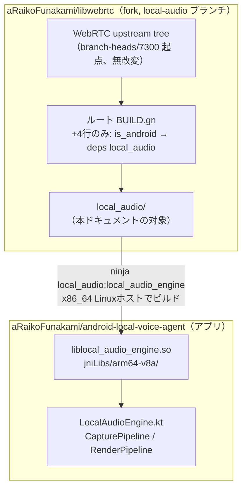
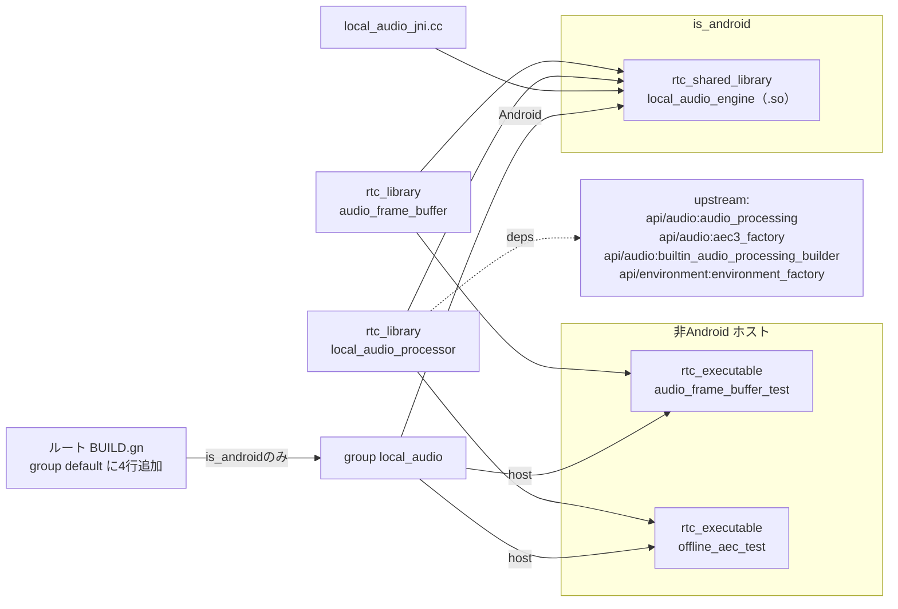
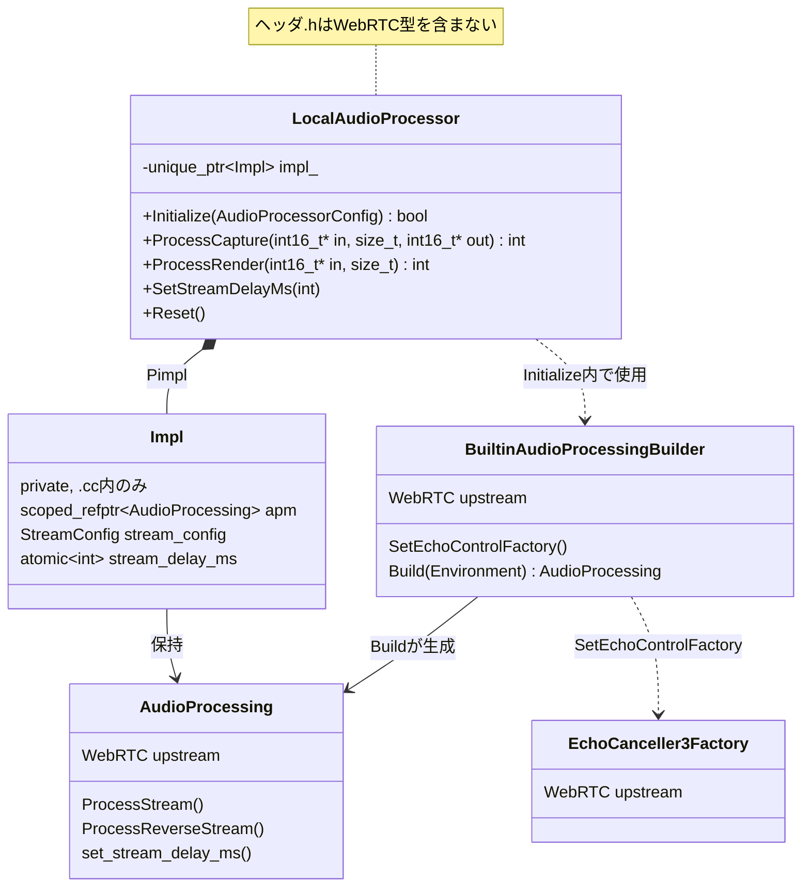
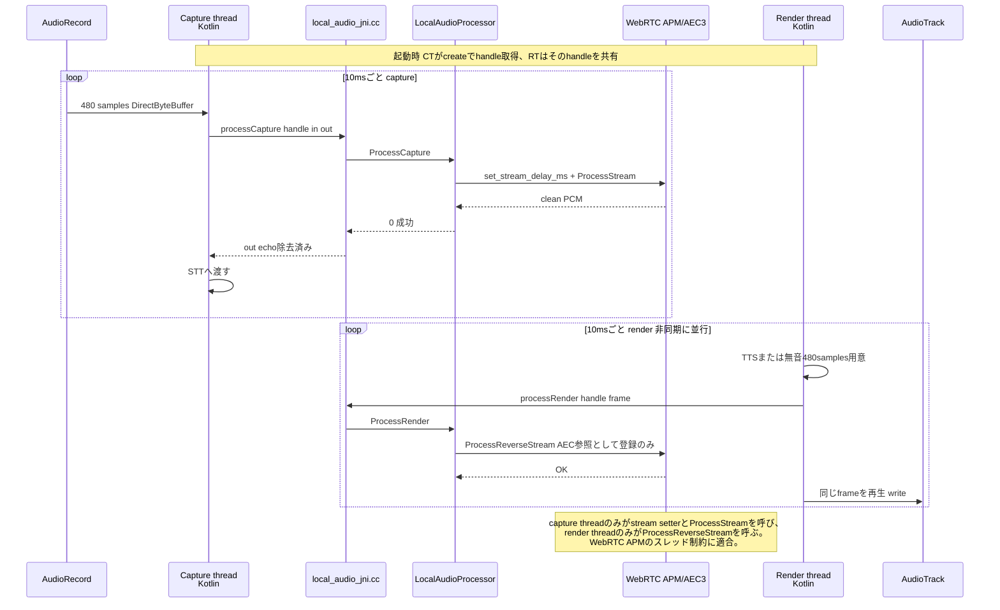
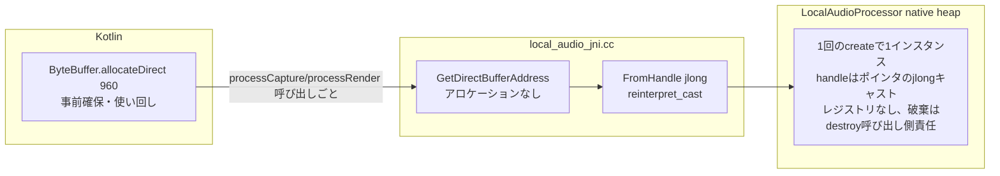

# local_audio アーキテクチャ

[README.md](README.md) が「何を・なぜ・どう使うか」を説明するのに対し、本ドキュメントは
**構造と実行時の流れ**を図で説明する。

## 1. システム全体（2リポジトリの境界）

`local_audio` は WebRTC fork 内の1ディレクトリであり、通信スタック（PeerConnection等）とは
独立に APM/AEC3 だけを Android アプリへ届けるための境界層。アプリ側は `.so` を受け取るだけで、
WebRTC のソースツリーにもビルドシステムにも依存しない。

## 2. GN ビルドターゲット依存関係

`local_audio/BUILD.gn` 内のターゲット構成。Android では `.so` 一つに、
ホストではテスト実行ファイル2本に分岐する（`group("local_audio")` が入口）。

## 3. クラス構成（WebRTC 型の隠蔽）

`LocalAudioProcessor` は Pimpl で WebRTC の型（`AudioProcessing`, `EchoCanceller3Factory` 等）を
`.cc` 側に閉じ込める。ヘッダを見る側（JNI や将来の別バックエンド実装）は WebRTC を一切意識しない。

## 4. 実行時データフロー（10ms サイクル、2スレッド構成）

capture / render は**別スレッド**だが、**同一の `AudioProcessing` インスタンス**（= 同一
`LocalAudioProcessor`）を共有する。二重に APM を作ると AEC 状態が分裂して破綻するため、
アプリ側は capture 開始時に作った `LocalAudioProcessor` の handle を render 側へ渡す設計にしている
（[CapturePipeline.kt](https://github.com/aRaikoFunakami/android-local-voice-agent/blob/main/app/src/main/java/com/example/localvoiceagent/audio/CapturePipeline.kt) /
[RenderPipeline.kt](https://github.com/aRaikoFunakami/android-local-voice-agent/blob/main/app/src/main/java/com/example/localvoiceagent/audio/RenderPipeline.kt)）。

## 5. JNI 境界（DirectByteBuffer 契約）

audio callback path（capture/render 両スレッド）では JNI 呼び出しごとのヒープ確保をしない設計。
`ByteBuffer` はアプリ起動時に確保して使い回し、`create()`/`destroy()` のみが確保・解放を伴う。

## 関連ドキュメント

- [README.md](README.md) — 変更内容・検証結果・API使用例
- [android-local-voice-agent](https://github.com/aRaikoFunakami/android-local-voice-agent) — アプリ全体のアーキテクチャ（STT/LLM/TTSを含む）
